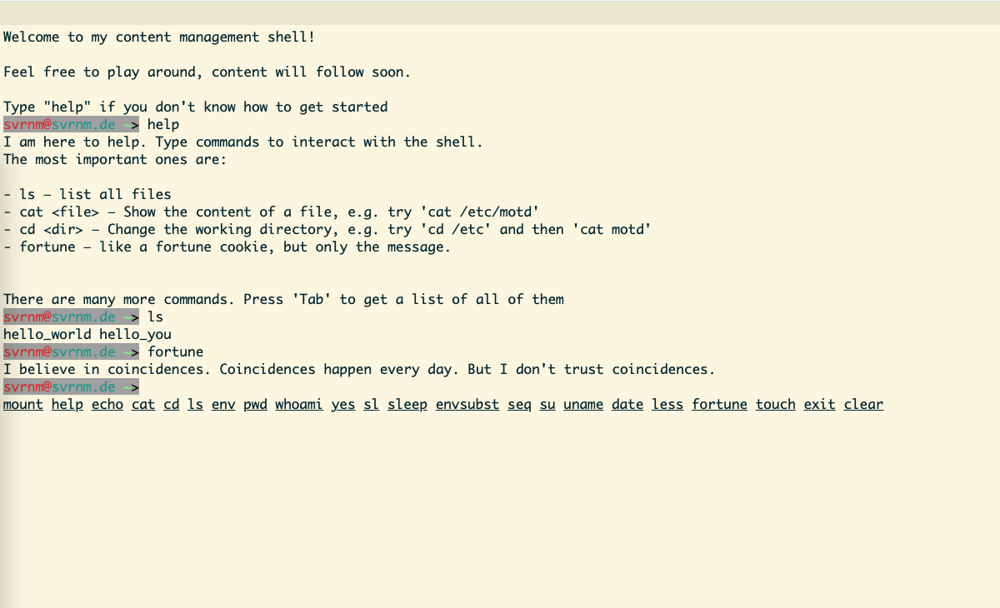

# cm.sh - the content management shell

Let's be honest, nobody likes Content Management Systems (CMS), they are bulky, buggy and worst of all they don't have a shell-like experience.

Content Management Shell is hear to change this, it's still buggy, it's probably also going to be bulky, but it has a shell-like experience!

## Preview

Want to see cmsh in action, got to [svrnm.de](https://svrnm.de) and try it out yourself



## Quickstart

You can also run cmsh on your local machine:

```shell
git clone git@github.com:svrnm/cmsh.git
cd cmsh
```

Next, start a local webserver, there are different ways of doing it, e.g. with python:

```shell
python3 -m http.server
```

Go to http://localhost:8000 and enjoy your content management shell!

## Configure

If you'd like to run cm.sh as your own, you need to update the domains in `index.html` first:

```html
<meta property="og:image" content="https://YOURDOMAIN/teaser.png"/>
<meta property="og:url" content="https://YOURDOMAIN"/>
<meta property="og:title" content="#!/bin/cmsh – YOURDOMAIN"/>
<meta property="og:description" content="Welcome to my personal content management shell. Feel free to explore."/>
```

Next, you can set a environment variables and mount points in [./cmsh/config.js](cmsh/config.js):

```javascript
export default {
  environment: {
    USER: 'USERNAME',
    HOSTNAME: 'YOURDOMAIN',
    HOME: '/home/USERNAME',
    PS1: '\\e[31;100m\\u@\\e[36;100m\\h \\e[92;100m\\w\\e[30;100m>\\e[0m '
  },
  fstab: [
      {
        deviceSpec: 'base.js',
        mountPoint: '/',
        fsType: 'jfs',
        options: 'ro'
      },
      /* ... */
  ]
}
```
